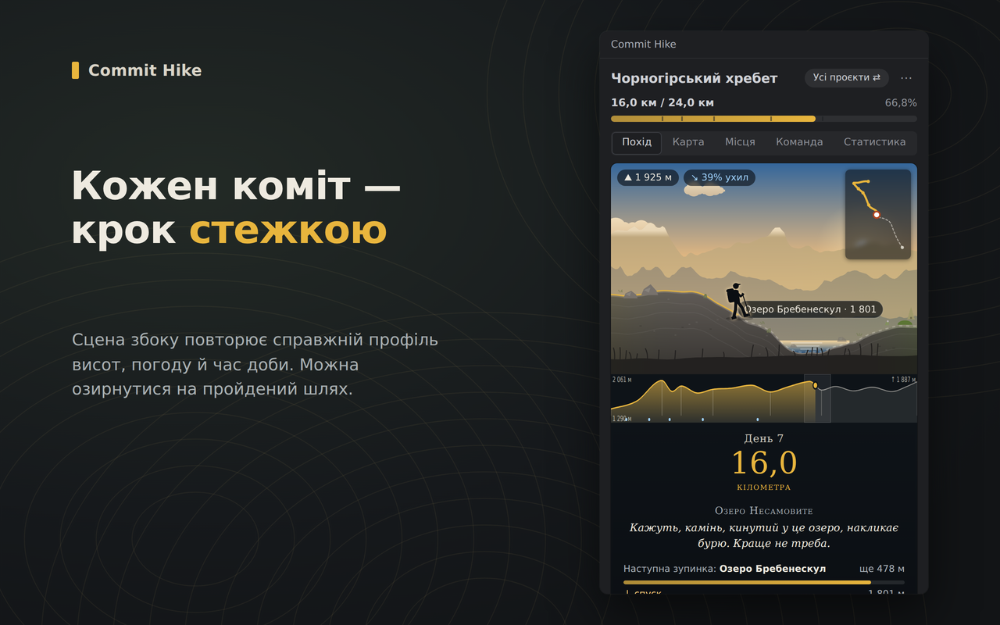
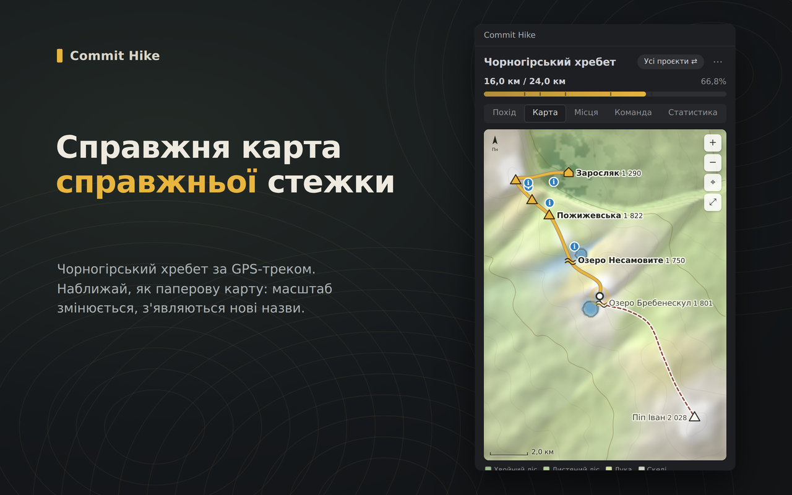
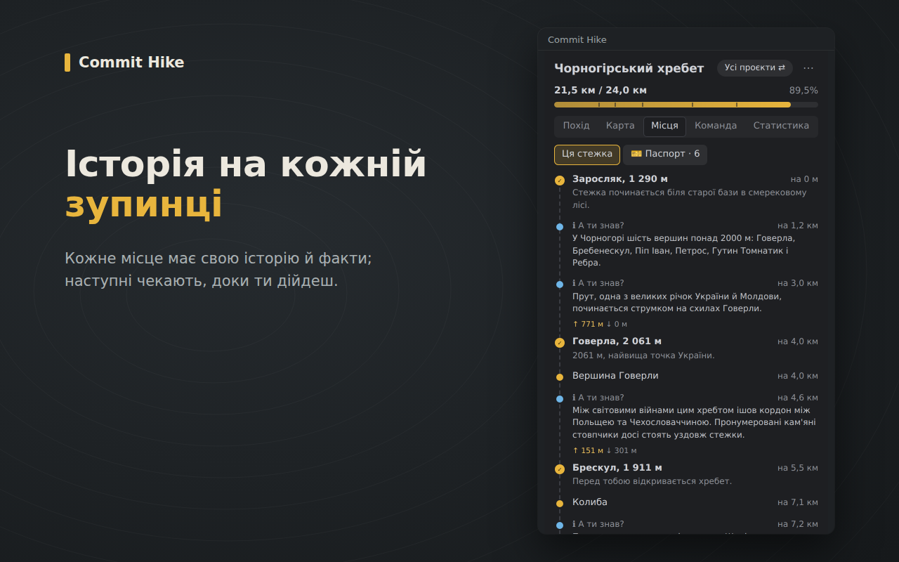
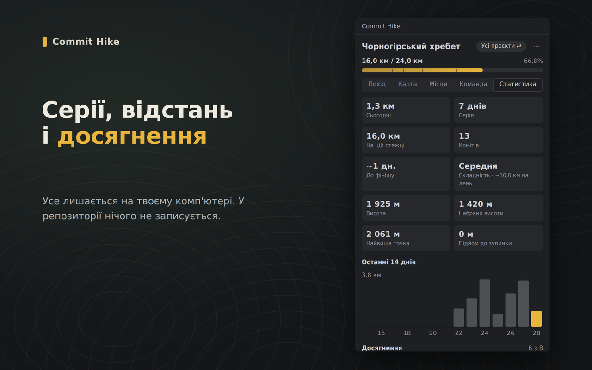

# Commit Hike

[](https://plugins.jetbrains.com/plugin/34595)
[](https://plugins.jetbrains.com/plugin/34595)
[](https://open-vsx.org/extension/shchusia/commit-hike)
[](https://open-vsx.org/extension/shchusia/commit-hike)
[](https://github.com/Shchusia/commit-hike)
[](LICENSE)

*[English](README.md) · [Що нового](CHANGELOG.md)*

Кожен твій коміт просуває тебе туристичною стежкою просто в IDE. День
рівної роботи — це близько десяти кілометрів справжнім гірським хребтом,
пустелею чи казкою: зі сценою, що змінюється дорогою, картою, історіями,
фактами й досягненнями.

<p align="center">
  
  
</p>
<p align="center">
  
  
</p>

## Можливості

- **Справжні, книжкові й авторські маршрути.** Пройди Чорногірський хребет через Говерлу й новозеландський Альпійський перехід Тонґаріро їхніми справжніми GPS-треками, дорогу Сантьяго з «Алхіміка» справжніми Іспанією, Марокко, Сахарою та Єгиптом на справжньому рельєфі, казкову стежку Карпатами або фентезі-мандрівку повз сім маяків. У кожного маршруту свої зупинки, історія, факти й досягнення.
- **Справжній підйом.** У маршрутів є профіль висот: земля здіймається й опускається, мандрівник нахиляється на схилі, а ти бачиш висоту, ухил, скільки вже набрав і скільки підйому до наступної зупинки. Є досягнення за висоту.
- **Жива сцена.** Небо змінюється з твоїм годинником, погода — щодня. Місцевість змінюється разом із маршрутом: хвойні ліси, листяні гаї, що восени золотіють, луки, поля, степ, пустеля, скелі, сніг, тундра, озера, болота, узбережжя, вулкани й села — і вони плавно перетікають одне в одне.
- **Є що знайти.** Пакети маршрутів розставляють уздовж стежки зображення (SVG, PNG, JPG, WebP, GIF) або невеликі анімовані HTML-сценки. Вони проступають, коли ти наближаєшся, і зникають, коли минаєш їх. Факти про місця відкриваються дорогою.
- **Мінікарта й справжня карта.** У поході є мінікарта всієї стежки. На вкладці карти — топографічна карта, згенерована з самого маршруту: горизонталі, відмивка рельєфу, ліси, озера й море, пройдені зупинки, знайдені факти й команда. Справжні маршрути намальовані з GPS-треку в реальному масштабі. Масштабування й перетягування, як на паперовій карті: масштабна лінійка змінюється разом із зумом, значки й підписи зберігають розмір, а при наближенні з'являється більше підписів. Маршрут може принести й власну мальовану карту.
- **Ідемо разом.** Увімкни команду для проєкту — і всі, хто в нього комітить, з'являться на тій самій стежці, з таблицею лідерів. Імена беруться з історії git і ніде не зберігаються.
- **Справжні відстані, твоя складність.** Маршрути мають справжню довжину: дорога Сантьяго — близько 4370 км. Типовий день комітів просуває тебе приблизно на 10 км на середній складності (12,5 на легкій, 8 на складній) — це близько половини дня пішого походу, тож довгий маршрут стає ціллю на місяці. Зміна складності діє відтоді, а ще видно, скільки типових днів лишилося.
- **Тунелі й зустрічі.** Проходь копальні й печери при світлі ліхтаря і відчуй, як світ холоне й темніє там, де дорогу перетнула небезпека.
- **Без спойлерів.** Пройдений шлях можна роздивитися, а те, що попереду, лишається прихованим, доки не дійдеш.
- **Чесна відстань.** Метри ростуть разом із розміром коміту, але повільно: маленькі коміти теж рахуються, а великими «накрутити» не вийде. Lock-файли, згенерований код, зміни лише в пробілах і чужі коміти не рахуються. Після squash, rebase чи amend історія перераховується, а не рахується двічі.
- **Власні маршрути й карти.** Створи маршрут із заготовки, додай зображення й карту та імпортуй як теку або `.zip` просто з IDE. Див. [docs/routes.md](docs/routes.md).
- **Власний мандрівник.** Заміни стандартну фігурку будь-яким PNG із прозорим фоном. Стандартна, [`ui/panel/hiker-default.png`](ui/panel/hiker-default.png), показує очікуваний формат: дивиться праворуч, ноги біля нижнього краю.
- **Твоя мова.** Увесь плагін англійською й українською: тексти маршрутів, вигляд стежки, сповіщення, діалоги й меню. Перемикається в меню плагіна або як в IDE.
- **Приватність за замовчуванням.** У твої репозиторії нічого не записується, і нічого не залишає твій комп'ютер. Не зберігаються ні код, ні повідомлення комітів, ні назви файлів чи репозиторіїв.

## Підтримувані IDE

| IDE | Де взяти |
|---|---|
| IDE JetBrains 2024.3+: PyCharm, IntelliJ IDEA, GoLand, WebStorm, PhpStorm, RubyMine, CLion, Rider… | [JetBrains Marketplace](https://plugins.jetbrains.com/plugin/34595) |
| VSCodium, Cursor, Windsurf та інші редактори з Open VSX | [Open VSX](https://open-vsx.org/extension/shchusia/commit-hike) |
| VS Code 1.85+ | незабаром у Visual Studio Marketplace; поки що встанови `.vsix` з Open VSX |

## Встановлення

**IDE JetBrains.** Відкрий **Settings → Plugins → Marketplace**, знайди
*Commit Hike* і натисни **Install**. Або відкрий
[сторінку плагіна](https://plugins.jetbrains.com/plugin/34595) і натисни
**Install to IDE**.

**VSCodium, Cursor, Windsurf.** Відкрий панель розширень, знайди
*Commit Hike* і натисни **Install**. Або скористайся
[сторінкою на Open VSX](https://open-vsx.org/extension/shchusia/commit-hike).

**VS Code.** Поки Commit Hike немає у Visual Studio Marketplace, завантаж `.vsix`
зі [сторінки на Open VSX](https://open-vsx.org/extension/shchusia/commit-hike)
(**Download**), потім у VS Code відкрий панель розширень, **⋯ → Install from VSIX…**
і вибери файл.

**З коду.** Див. [Розробка](#розробка): `task jetbrains:install` або
`task vscode:install`.

## Як користуватися

Відкрий вікно інструментів **Commit Hike** (JetBrains) або панель Commit Hike на
бічній панелі (VS Code). Першого разу коротке налаштування спитає, які проєкти
рахувати й звідки почати подорож. А далі просто комітиш.

| Вкладка | Що там |
|---|---|
| **Похід** | Сцена збоку з мандрівником, сьогоднішня відстань, день подорожі й історія місця. Пройдений шлях можна гортати коліщатком миші, перетягуванням або ← →. |
| **Карта** | Уся стежка на топографічній карті. Масштаб — коліщатком або +/−, перетягуй, щоб рухати, ⌖ повертає до тебе. |
| **Місця** | Усі зупинки: пройдені — з історіями, наступні — з відстанню, що лишилася. |
| **Команда** | Усі, хто комітить у цей проєкт, на тій самій стежці, якщо команду увімкнено. |
| **Статистика** | Сьогодні, серії, останні 14 днів, набір висоти, досягнення й версія плагіна. |

Решта — у **Tools → Commit Hike** (JetBrains) або в палітрі команд у розділі
*Commit Hike* (VS Code): вибір стежки, імпорт власного маршруту, іконка
мандрівника, складність, мова, чи рахувати проєкт і перерахунок проєкту з
історії git.

Прогрес зберігається в `~/.config/commit-hike` (Linux), `~/Library/Application
Support/commit-hike` (macOS) або `%AppData%\commit-hike` (Windows). `task data:where`
покаже, де саме.

## Структура репозиторію

```
core/                рушій на Go: підрахунок, збереження, маршрути, досягнення, переклади, малювання
  content/routes/    вбудовані маршрути (route.json + locales/*.json + assets/)
  tools/uncovered/   показує, що не покрито тестами
ui/panel/            панель зі стежкою, спільна для всіх плагінів
plugins/vscode/      розширення для VS Code (TypeScript)
plugins/jetbrains/   плагін для IDE JetBrains (Kotlin)
extras/routes/       маршрути, які ніколи не публікуються (лише для особистого користування)
scripts/             помічники для релізу: налаштування, версія, перевірки, нотатки
docs/                архітектура, протокол, маршрути, публікація
```

## Розробка

Потрібні Go, Node.js 22, JDK 21 і [Task](https://taskfile.dev)
(`sudo snap install task --classic`).

```bash
task setup               # перевірити інструменти, встановити лінтери, завантажити залежності
task                     # список усіх команд
task check               # усе, що перевіряє CI: лінтери, вразливості, тести, поріг покриття
task test                # усі тести: ядро, маршрути, VS Code, JetBrains
task lint                # golangci-lint, ESLint + tsc, ktlint
task fmt                 # форматування Go й Kotlin

task core:demo REPO=~/projects/my-app    # спробувати ядро на справжньому репозиторії (тестові дані)
task core:run -- status --lang uk         # викликати будь-яку команду ядра
task route:new ID=my-trail                # почати новий вбудований маршрут
task route:try SRC=path/to/route          # перевірити пакет маршруту в пісочниці
task routes:install-extras                # додати особисті маршрути з extras/ у свій плагін

task deps:outdated       # що можна оновити
task deps:update         # оновити залежності й перезапустити всі перевірки
```

### Збірки для розробки й для користувачів

| | prod (за замовчуванням) | dev |
|---|---|---|
| Для кого | маркетплейси, `task jetbrains:install` | для тебе під час розробки |
| Вкладка «Похід» | видно лише пройдене: без спойлерів | можна дивитися вперед по всій стежці |
| Як зібрати | `task jetbrains:install`, `task vscode:install` | `task dev:jetbrains`, `task dev:vscode` або `FLAVOR=dev` для будь-якої збірки |

`task jetbrains:run` / `task jetbrains:run-pycharm` (окрема тестова IDE) і F5 у
VS Code завжди поводяться як dev-збірки. На вкладці «Статистика» видно версію
й позначку, якщо це збірка для розробки.

### Тести й покриття

```bash
task coverage            # усі три мови
task core:cover          # Go: по пакетах, кожен непокритий рядок із назвою функції, HTML-звіт; падає нижче 80%
task core:cover MIN=85   # інший поріг
task vscode:cover        # TypeScript із непокритими рядками (орієнтуйся на branch і funcs %: імпорти рахуються як рядки)
task jetbrains:cover     # Kotlin через Kover, по класах, плюс HTML-звіт
```

Звіти — у `.sandbox/cover/` і `plugins/jetbrains/build/reports/kover/`.

## Випуск релізу

Одне налаштування, далі — одна команда на реліз. Докладно, з акаунтами,
токенами й підписом, — у [docs/publishing.md](docs/publishing.md).

```bash
task release:configure OWNER=твій-нік NAME="Твоє Ім'я" EMAIL=you@example.com   # один раз
task version:set V=0.2.0     # записи під [Unreleased] у CHANGELOG.md стають версією 0.2.0
task release:check           # версія, changelog, видавець і вміст готові
task release:build           # рівно те, що отримають маркетплейси, після всіх перевірок
git commit -am "Release 0.2.0" && git tag v0.2.0 && git push --follow-tags   # CI публікує
```

## Як додати маршрут або переклад

Маршрут — це тека з `route.json`, файлом на кожну мову й необов'язковими
зображеннями. Код змінювати не потрібно, див. [docs/routes.md](docs/routes.md).
Справжні маршрути можуть мати GPS-трек, тоді карта показує їх у реальному
масштабі. Якщо переклад неповний, тести падають, тож відсутній рядок ніколи
не дійде до користувачів.

Маршрути за книжками, фільмами чи іграми потребують дозволу правовласника.
Вбудовані фентезі-маршрути — авторські; маршрути в чужих світах лежать у
`extras/` і ніколи не публікуються.

## Як це працює

Плагіни для IDE тонкі: вони помічають коміти й малюють результат. Уся логіка
живе в одному невеликому бінарнику на Go, який плагіни викликають і який
відповідає версіонованим JSON. Докладніше:
[docs/architecture.md](docs/architecture.md), [docs/protocol.md](docs/protocol.md).

## Підтримати проєкт

Commit Hike безкоштовний і з відкритим кодом. Якщо тобі подобається похід:

- ⭐ постав зірку репозиторію: так його легше знайти іншим розробникам;
- оціни плагін на [JetBrains Marketplace](https://plugins.jetbrains.com/plugin/34595) або [Open VSX](https://open-vsx.org/extension/shchusia/commit-hike/reviews);
- повідомляй про помилки і ділися ідеями в [issues](https://github.com/Shchusia/commit-hike/issues);
- створи маршрут і поділись ним: див. [docs/routes.md](docs/routes.md).

## Ліцензія

[MIT](LICENSE)
